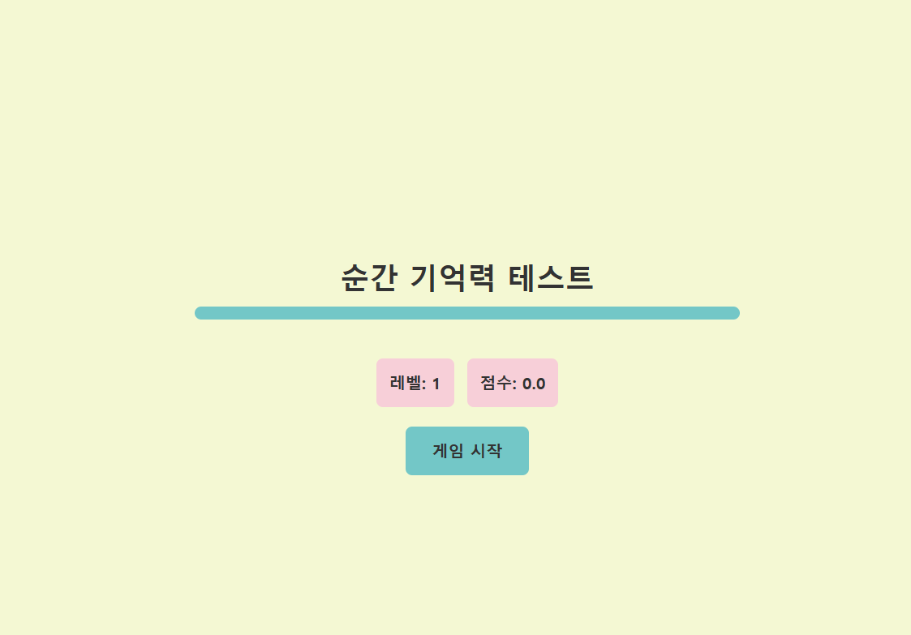

# 순간 기억력 테스트 게임

**순간 기억력 테스트 게임**은 숫자가 나타나고, 그 숫자를 순서대로 클릭하여 기억력을 테스트하는 게임입니다. 난이도가 점차 상승하며, 자신의 점수를 랭킹에 등록하여 다른 사용자와 경쟁할 수 있습니다. 이 프로젝트는 React와 Next.js를 기반으로 제작되었으며, 상태 관리를 위해 Zustand를 사용하고, 애니메이션 효과는 GSAP를 활용했습니다.

## 📺 게임 시연영상

## 

## 📌 프로젝트 목적

이 프로젝트는 사용자의 기억력을 테스트하고, 점차 난이도가 상승하는 게임을 통해 도전 정신을 자극합니다. 또한, 랭킹 시스템을 통해 경쟁 요소를 추가하여 사용자 경험을 더욱 풍부하게 만듭니다.

---

## 주요 기능

- **기억력 테스트**: 숫자를 순서대로 클릭하여 기억력을 테스트합니다.
- **난이도 상승**: 레벨이 올라갈수록 숫자의 개수가 증가하며 난이도가 점차 상승합니다.
- **점수 랭킹**: 자신의 점수를 랭킹에 등록하고 다른 사용자와 경쟁할 수 있습니다.
- **반응형 디자인**: 데스크톱과 모바일 환경에서 모두 최적화된 UI 제공.
- **랭킹 등록 및 공유**: 게임 결과를 랭킹에 등록하고, URL을 복사하여 공유할 수 있습니다.

---

## 기술 스택

### 프론트엔드

- **React**: 컴포넌트 기반 UI 라이브러리.
- **Next.js**: 서버 사이드 렌더링 및 정적 사이트 생성 지원.
- **Tailwind CSS**: 빠르고 효율적인 스타일링.

### 상태 관리

- **Zustand**: 간단하고 직관적인 상태 관리 라이브러리.

### 애니메이션

- **GSAP (GreenSock Animation Platform)**: 고성능 애니메이션 라이브러리.

### 백엔드

- **Redis**: 빠른 데이터 저장 및 조회를 위한 인메모리 데이터베이스.

### 배포

- **Vercel**: Next.js 애플리케이션 배포 플랫폼.

---

## Api 문서

### 랭킹 추가

- URL: /api/rank (POST)
- 요청 바디:{
  "name": "사용자 이름",
  "level": 5,
  "score": 123.4
  }
- 응답:{"message": "Rank added successfully!"}

### 랭킹 조회

- URL: /api/rank (GET)
- 응답: [
  {
  "name": "사용자1",
  "level": 5,
  "score": 123.4
  },
  {
  "name": "사용자2",
  "level": 4,
  "score": 100.0
  }
  ]
